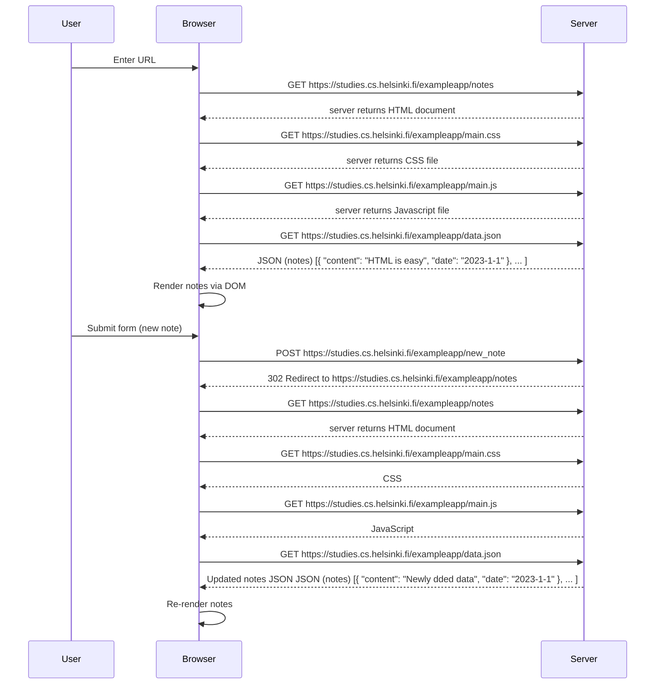

# 📋 Request-Response Sequence: Classic Notes App (Non-SPA Version)

This document outlines the request-response flow when a user interacts with the classic (non-SPA) version of the Notes app at  
`https://studies.cs.helsinki.fi/exampleapp/notes`.

## 🧭 Overview

The diagram represents how the browser communicates with the server when:

1. The user opens the page
2. A new note is submitted via the form

### Submitting a New Note

1. **User Action:**  
   - Submits the note form.

2. **Browser Sends:**
   - `POST /new_note` with the note content.

3. **Server Responds:**
   - `302 Redirect` back to `/notes`.

4. **Browser Reloads:**
   - Repeats the entire request sequence:
     - HTML → CSS → JS → Updated JSON (now includes the new note)

5. **Browser Re-Renders:**
   - All notes including the newly added one are displayed.

---

## 💡 Notes

- This flow is **page reload–based** (non-SPA).
- Each note submission reloads the entire page and re-fetches resources.
- Efficient for small apps but not optimal for performance in large-scale systems.

