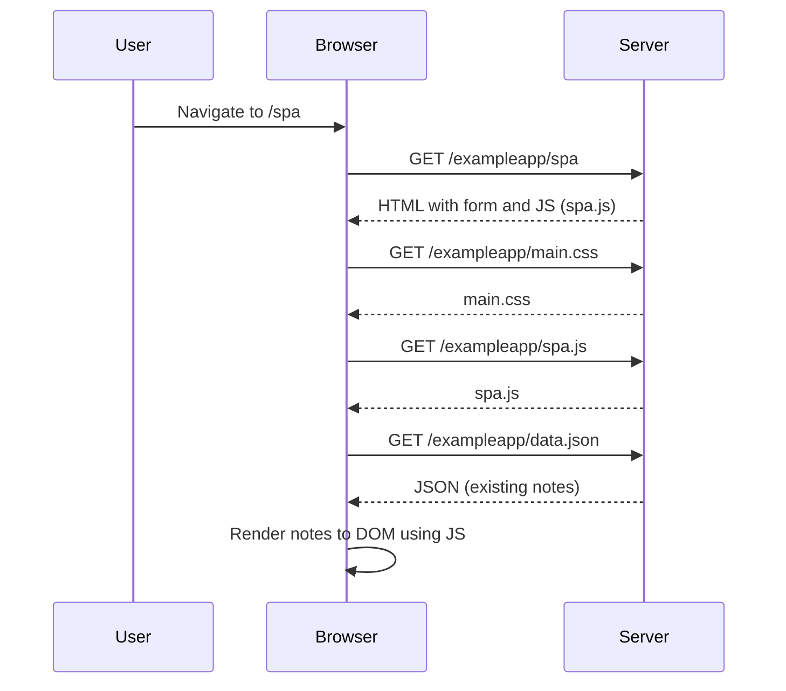

# 🚀 SPA Page Load Sequence — Notes App

This document describes the request-response flow when a user visits the **Single Page Application (SPA)** version of the Notes app at  
`https://studies.cs.helsinki.fi/exampleapp/spa`.

## 🧭 Overview

The SPA version avoids full-page reloads by dynamically rendering content using JavaScript. Here's what happens when the user first visits the SPA page.

---

## 🔄 Sequence Breakdown

### Page Load (SPA Initialization)

1. **User Action:**  
   - User navigates to `/spa`.

2. **Browser Requests:**
   - `GET /exampleapp/spa` → HTML page (includes empty DOM container and script reference to `spa.js`)
   - `GET /exampleapp/main.css` → for page styling
   - `GET /exampleapp/spa.js` → JavaScript logic for handling SPA features
   - `GET /exampleapp/data.json` → JSON file with existing notes

3. **Browser Actions:**
   - HTML + CSS are rendered
   - JS (`spa.js`) executes
   - JS fetches the note data
   - JS dynamically renders the notes to the DOM without a full reload

---

