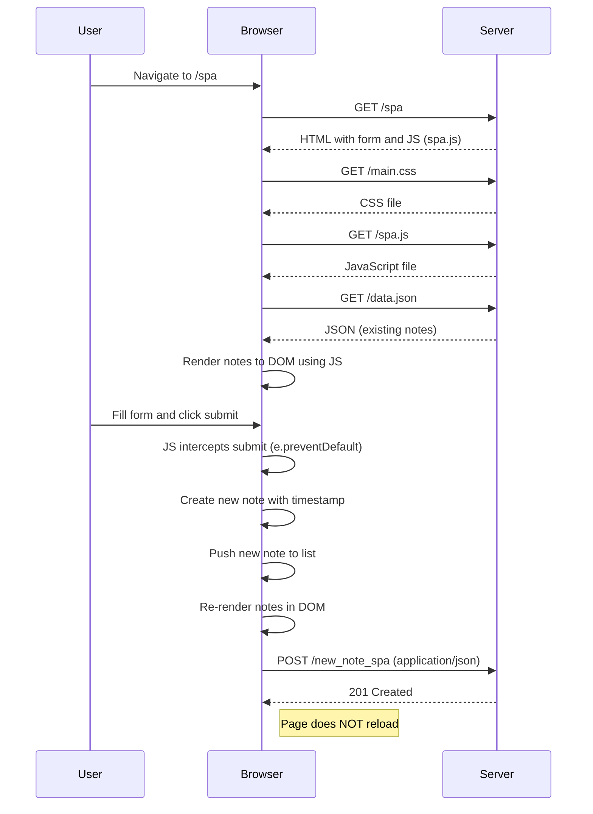

# 📝 SPA — Submitting a New Note

This document explains the request-response sequence when a user adds a new note on the **SPA (Single Page Application)** version of the Notes app at  
`https://studies.cs.helsinki.fi/exampleapp/spa`.

---

## ⚙️ Sequence: New Note Submission (SPA)

### 1. Page Initialization (Same as Page Load)
- User visits `/spa`
- Browser loads:
  - HTML (`/spa`)
  - CSS (`/main.css`)
  - JS logic (`/spa.js`)
  - Existing notes data (`/data.json`)
- JavaScript renders notes to the DOM dynamically.

---

### 2. New Note Flow (Client-Side Controlled)

1. **User Action:**  
   - User fills the form and clicks "Submit".

2. **JavaScript Intercepts the Action:**
   - `event.preventDefault()` stops default form submission.
   - A new note object is created locally with timestamp and content.

3. **DOM Update (No Page Reload):**
   - New note is immediately pushed into the local list.
   - Browser re-renders the full notes list using JS.

4. **Data Persistence:**
   - `POST /new_note_spa` is sent to the server with the new note in JSON format.
   - Server responds with `201 Created`.

5. **User Experience:**
   - Instant update on screen.
   - **No page reload**, all handled by frontend logic.

---

